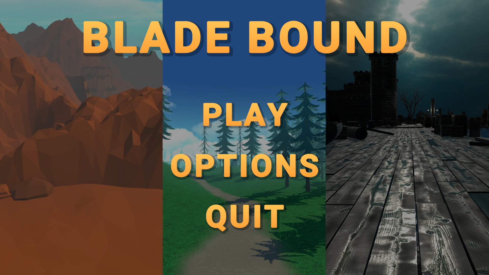

# Blade Bound

## 🎮 Game Overview

**Blade Bound** is an action-adventure 3D game developed in Unity where players wield powerful blades to battle through multiple levels filled with enemies and challenging boss encounters. This game was created as a group project for a University Game Development course and represents our team's first collaborative game development experience.

> **Developer Note:** This game is not perfect and contains various bugs and architectural issues. However, our team learned a tremendous amount through the development process. It represents our very first group game project, and we're proud of what we accomplished despite the imperfections.

## ⚔️ Game Features

### Combat System
- **Melee Combat**: Engage in close-quarters combat with a variety of blade weapons
- **Projectile System**: Launch magical projectiles for ranged attacks
- **Combo System**: Chain attacks together for increased damage and effects
- **Health Management**: Monitor your health and collect health orbs to survive

### Multiple Levels
- **Level 0**: Introductory stage with basic enemies and learning mechanics
- **Level 1**: Intermediate challenge with more complex environments and enemy patterns
- **Level 2**: Advanced stage with the most challenging enemies and final boss encounter

### Enemy Variety
- **Standard Enemies**: Various skeleton warriors with different attack patterns
- **Elite Enemies**: Stronger variants with special abilities and increased health
- **Boss Battles**: Three unique boss encounters (one at the end of each level)
  - **Boss 0**: First challenging encounter testing basic combat skills
  - **Boss 1**: Mid-game boss with more complex attack patterns
  - **Boss 2**: Final boss with the most challenging mechanics

### Progression System
- **Gate Mechanisms**: Progress through levels by defeating enemy groups to unlock gates
- **Trigger Systems**: Environment reacts to player presence and actions
- **Level Completion**: Finish levels by defeating the final boss and reaching the goal

### Visual and Audio Elements
- **Fantasy Environments**: Explore detailed fantasy worlds with varied terrain
- **Particle Effects**: Dynamic visual effects for combat, magic, and environment
- **Sound System**: Responsive audio for combat, movement, and ambient environment
- **UI Systems**: Health bars, menus, and game status indicators

## 🎮 Controls

- **WASD**: Character movement
- **Mouse**: Camera control
- **Left Mouse Button**: Basic attack
- **Right Mouse Button**: Special attack/Block
- **Space**: Jump
- **Shift**: Sprint
- **E**: Interact
- **Esc**: Pause menu

## 🛠️ Technical Implementation

### Core Systems
- **Player Controller**: Fluid third-person character control system
- **Camera System**: Dynamic camera that follows player action
- **Enemy AI**: Intelligent enemy behavior with player detection and attack patterns
- **Level Progression**: Gate systems that track enemy defeats to progress
- **Sound Management**: Comprehensive audio system for game events and music
- **Menu System**: Intuitive menu navigation for game options

### Architecture
- Organized script structure by level and functionality
- Modular enemy and boss behavior systems
- Reusable gate and trigger mechanisms across levels
- Optimized rendering with Unity's Universal Render Pipeline

## 🚀 Getting Started

### Prerequisites
- Unity 2021.3 or later (the version used for development)
- Basic understanding of Unity interface

### Installation
1. Clone the repository or download the project
2. Open the project in Unity
3. Open the main menu scene in Assets/Scenes/MENU
4. Press Play to start the game

## 🧪 Development Process

This game was developed as a team project for a University Game Development course. Our development process included:

1. Initial concept and design phase
2. Core mechanics implementation
3. Level design and enemy placement
4. Boss battle mechanics development
5. Visual effects and polish
6. Testing and refinement

### Learning Experience

As our first collaborative game project, Blade Bound provided extremely valuable lessons in:

- Team collaboration and communication in game development
- Code architecture and organization challenges
- Real-time problem-solving and debugging
- Game performance optimization
- Technical debt management
- The importance of documentation and version control

While the game has its flaws in terms of bugs and architecture design, each challenge helped us grow as developers. We gained practical experience that theoretical learning alone couldn't provide, making this project an essential stepping stone in our development journey.

## 🤝 Contributing

Although this is our first game developed as a team and may contain imperfections, we welcome contributions and extensions to the project. Feel free to fork the repository and submit pull requests for:

- Bug fixes
- Performance improvements
- New features or levels
- Enhanced visual effects
- Additional enemy types or boss battles

## 📝 License

This project is available for free use and modification. Please credit the original team if you build upon our work.

## 🙏 Acknowledgments

- Special thanks to our University Game Development course instructors
- Thanks to all team members who contributed to the project
- Asset acknowledgments:
  - TextMesh Pro for UI text rendering
  - Fantasy Skybox FREE for atmospheric environments
  - Bitgem for stylized effects
  - Old Sea Port for environmental details
  - @PaulosCreations for projectile systems
  - Hovl Studio for visual effects
  - Polytope Studio for character models

## 📞 Contact

For any questions about the project, please contact the team lead through GitHub.

---

**Note**: This game was developed as a learning project and may contain bugs or unrefined elements. We apologize for any issues you might encounter and appreciate your understanding as this represents our first team game development experience.